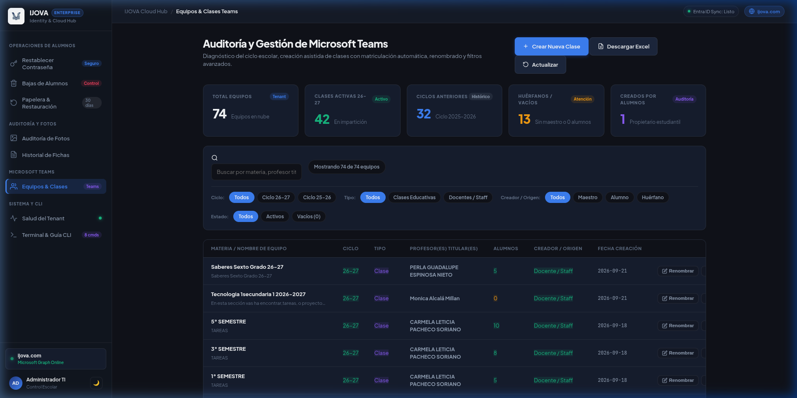
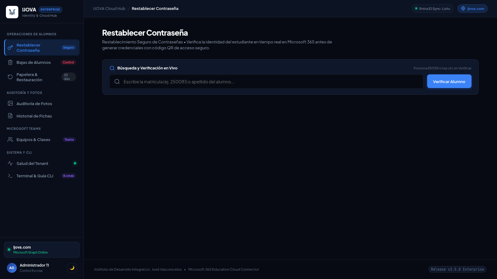
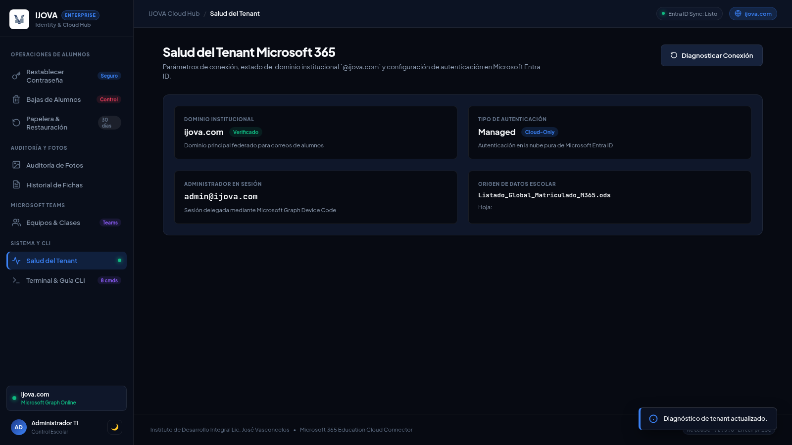
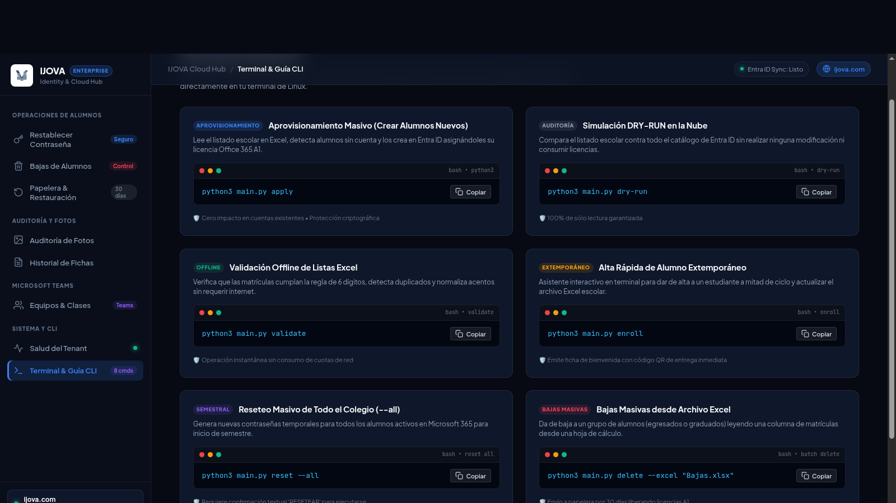

# Sistema de Gestión, Aprovisionamiento y Sincronización Segura de Alumnos hacia Microsoft 365 Education / Microsoft Entra ID

Herramienta institucional desarrollada en Python 3 para entornos Linux, diseñada para la validación, auditoría, aprovisionamiento masivo, gestión del ciclo escolar y control de identidades en **Microsoft 365 Education** y **Microsoft Entra ID**. Opera bajo los principios de **mínimo privilegio**, **cero impacto sobre usuarios existentes** y **estricta confidencialidad de datos personales**.

---

## Principios de Seguridad y Reglas de Integridad

1. **Protección Total de Cuentas Existentes**:
   - Ningún usuario existente en el tenant de Microsoft 365 es modificado, alterado o eliminado durante los procedimientos de sincronización masiva.

2. **Criterio Unívoco de Existencia por UPN**:
   - La existencia de una cuenta se determina exclusivamente mediante su atributo `userPrincipalName` (UPN) en Microsoft Entra ID (`[matricula]@ijova.com`).

3. **Principio de Mínimo Privilegio**:
   - Autenticación delegada mediante Device Code Flow (`https://microsoft.com/devicelogin`) solicitando únicamente los alcances estrictamente requeridos para la operación institucional.

4. **Protección Criptográfica de Contraseñas Iniciales**:
   - Generación de contraseñas temporales aleatorias de 12 caracteres mediante entropía criptográfica (`secrets` de Python), forzando el cambio de contraseña en el primer inicio de sesión (`forceChangePasswordNextSignIn: True`).
   - Almacenamiento restringido en el directorio `secrets/` bajo permisos Unix `0600` (`-rw-------`), excluido de los sistemas de control de versiones.

5. **Salvaguarda contra Eliminación de Personal y Administradores**:
   - El motor de bajas valida que la matrícula sea estrictamente numérica y bloquea de manera terminante cualquier intento de remoción de cuentas pertenecientes a personal directivo, docente o administrativo.

6. **Retención Recuperable (Soft-Delete)**:
   - Todo proceso de eliminación traslada la cuenta a la papelera de reciclaje de Microsoft Entra ID, garantizando una ventana de recuperación íntegra de 30 días naturales.

7. **Respaldo Preventivo Automatizado**:
   - Generación automática de respaldos con marca de tiempo sobre los usuarios del tenant previo a cualquier operación de escritura.

8. **Verificación Previa y Confirmación Obligatoria de Alumno**:
   - Antes de modificar credenciales, el sistema consulta en tiempo real Microsoft Entra ID y valida contra el listado escolar oficial. Presenta la ficha completa de identidad (Nombre, Matrícula, UPN, Nivel, Grado y Fotografía) y requiere confirmación explícita para evitar modificaciones por error operativo.

9. **Aislamiento Local y Seguridad Perimetral HTTP**:
   - El servidor de la interfaz web se enlaza exclusivamente a la interfaz loopback (`127.0.0.1`), impidiendo el acceso desde redes locales o inalámbricas.
   - Incorpora protección en tiempo de ejecución: mitigación de DNS Rebinding, validación de origen y cabeceras de navegación (`Sec-Fetch-Site`), políticas estrictas de seguridad de contenido (`Content-Security-Policy`), denegación de encuadre (`X-Frame-Options: DENY`) y prevención de escalamiento de rutas (*path traversal*).

---

## Requisitos del Sistema

- **Sistema Operativo:** Linux (distribuciones basadas en Debian/Ubuntu, Fedora, RHEL, Arch Linux u homologadas).
- **Entorno de Ejecución:** Python 3.10 o superior.
- **Privilegios en la Nube:** Cuenta con rol administrativo en el tenant de Microsoft 365 para la concesión inicial de consentimiento.
- **Registro de Aplicación:** Microsoft Entra ID App Registration configurada.

---

## 1. Configuración de Aplicación en Microsoft Entra ID

1. Acceda al portal de administración de **[Microsoft Entra admin center](https://entra.microsoft.com/)**.
2. Diríjase a **Identity > Applications > App registrations > New registration**.
3. Registre los siguientes parámetros:
   - **Name:** `IJOVA-Provisioning-Tool`
   - **Supported account types:** `Accounts in this organizational directory only (Single tenant)`
   - **Redirect URI:** Seleccione la plataforma `Public client/native (mobile & desktop)` e ingrese `https://login.microsoftonline.com/common/oauth2/nativeclient`.
4. En **Authentication > Advanced settings > Allow public client flows**, seleccione **Yes** y confirme los cambios.
5. En **API permissions > Add a permission > Microsoft Graph > Delegated permissions**, agregue los siguientes alcances:
   - `User.ReadWrite.All`: Administración del ciclo de vida y licencias de usuarios.
   - `Domain.Read.All`: Validación del estado del dominio institucional.
   - `LicenseAssignment.Read.All`: Consulta de catálogo de licencias y SKUs.
   - `Group.ReadWrite.All`: Creación y gestión de grupos M365 y clases escolares.
   - `TeamSettings.ReadWrite.All`: Configuración y renombrado institucional de equipos.
   - `TeamMember.ReadWrite.All`: Matriculación asistida de estudiantes y docentes.
   - `Team.ReadBasic.All`: Consulta de inventario básico de equipos de Microsoft Teams.
   - Haga clic en **Grant admin consent for [Nombre de la Institución]**.
6. Tome nota del **Application (client) ID** y del **Directory (tenant) ID** disponibles en la sección general (*Overview*).

---

## 2. Instalación en Linux

```bash
# 1. Clonación del repositorio
git clone https://github.com/Pozole98/ijova-m365-sync.git
cd ijova-m365-sync

# 2. Creación del entorno virtual
python3 -m venv .venv

# 3. Activación del entorno virtual
source .venv/bin/activate

# 4. Instalación de dependencias
pip install -r requirements.txt
```

---

## 3. Configuración Inicial (`config.json`)

Copie el archivo de ejemplo `config.example.json` para generar la configuración local:

```bash
cp config.example.json config.json
```

Edite los parámetros en `config.json` con los identificadores correspondientes al tenant:

```json
{
  "tenant_id": "TU_TENANT_ID_GUID",
  "client_id": "TU_CLIENT_ID_GUID",
  "domain": "ijova.com",
  "excel_path": "Listado de Alumnos Inscritos.xlsx",
  "sheet_name": "Listado Global Matriculado",
  "auth_method": "device_code",
  "graph_scopes": [
    "User.ReadWrite.All",
    "Domain.Read.All",
    "LicenseAssignment.Read.All",
    "Group.ReadWrite.All",
    "TeamSettings.ReadWrite.All",
    "TeamMember.ReadWrite.All",
    "Team.ReadBasic.All"
  ],
  "reports_dir": "reports",
  "backups_dir": "backups",
  "data_dir": "data",
  "secrets_dir": "secrets"
}
```

---

## 4. Manual de Operación y Comandos del Sistema

### Modalidad 1: Menú Interactivo en Terminal (Recomendado)

Para acceder al entorno interactivo guiado, ejecute:

```bash
python3 main.py
```
*(Alternativamente: `python3 main.py menu`)*.

El menú organiza las operaciones del sistema en secciones temáticas:
- `[1]` a `[3]`: Validación local, simulación `dry-run` y aprovisionamiento masivo `apply`.
- `[4]`: Alta rápida extemporánea de alumnos de nuevo ingreso (`enroll`).
- `[5]` y `[6]`: Restablecimiento de contraseñas y emisión de fichas PDF institucionales.
- `[T]`: Módulo de Auditoría y Gestión de Microsoft Teams (escaneo en vivo, libro Excel de 4 hojas, renombrado y creación asistida de clases).
- `[7]` y `[8]`: Desaprovisionamiento seguro con validación de matrícula y restauración desde papelera.
- `[9]` a `[12]`: Diagnóstico de salud del tenant, generación de respaldos y auditoría de fotos.
- `[G]`: Lanzamiento de la interfaz gráfica web local.

---

### Modalidad 2: Interfaz de Línea de Comandos (CLI)

#### Comando `validate` (Validación Local Offline)
Verifica la consistencia estructural del archivo escolar, reglas de formato en matrículas y duplicados sin realizar conexiones externas:
```bash
python3 main.py validate
```

#### Comando `dry-run` (Simulación en Modo Lectura)
Conecta a Microsoft Graph API, obtiene el catálogo de usuarios de Entra ID y simula el proceso de sincronización reportando altas potenciales sin aplicar escrituras:
```bash
python3 main.py dry-run
```

#### Comando `apply` (Aprovisionamiento Masivo)
Crea las cuentas de alumnos nuevos en Microsoft Entra ID, asigna licencias **Office 365 Education A1**, almacena las credenciales iniciales en `secrets/` y preserva íntegramente las cuentas existentes:
```bash
python3 main.py apply
```

#### Comando `enroll` (Alta Individual Extemporánea)
Asistente interactivo en terminal para incorporar alumnos inscritos a mitad de ciclo:
```bash
python3 main.py enroll
```
- Valida la disponibilidad de la matrícula en Entra ID.
- Genera la cuenta institucional (`[matricula]@ijova.com`).
- Asigna la licencia estudiantil Office 365 A1.
- Actualiza el archivo escolar para mantener la paridad documental.
- Emite en pantalla la ficha de acceso de bienvenida.

#### Comando `export-pdf` (Generación de Fichas Institucionales con Código QR)
Genera comprobantes en formato PDF de alta resolución con instrucciones de acceso y código QR dirigido a `portal.office.com`:
```bash
# Formato de tarjetas recortables (4 por hoja)
python3 main.py export-pdf -m cards

# Formato de expediente individual (1 por hoja)
python3 main.py export-pdf -m full

# Especificación de archivo de credenciales y ruta de destino
python3 main.py export-pdf -f secrets/credenciales_alumnos_XXXX.csv -o reports/fichas.pdf
```

#### Comando `gui` (Panel de Control Web Local)
Inicia el servidor web local (`http://127.0.0.1:5000`) estructurado en 8 módulos operativos:

1. **Restablecimiento de Contraseñas:** Búsqueda en tiempo real por matrícula o nombre, visualización de fotografía institucional y confirmación obligatoria previa al cambio de clave.
2. **Control de Bajas de Alumnos:** Localización de la cuenta y requerimiento de confirmación textual de la matrícula para proceder con la deshabilitación.
3. **Papelera de Reciclaje y Restauración:** Catálogo de cuentas eliminadas en los últimos 30 días con restauración en un clic (preservando buzón, OneDrive y Teams).
4. **Auditoría y Administración de Microsoft Teams:**
   - Métricas globales de inventario: total de equipos, clases activas, ciclos históricos, huérfanos y creados por alumnos.
   - Clasificación por ciclo escolar: regla con fecha de corte al 1 de agosto de 2026 (`>= 2026-08-01` -> Ciclo 2026-2027; `< 2026-08-01` -> Ciclo 2025-2026).
   - Filtros dinámicos por ciclo, nivel educativo y tipo de creador.
   - Asistente de creación de clases con enrolamiento automático de alumnos matriculados por grado.
   - Renombrado y archivado institucional en línea.
   - Exportación de auditoría completa a libro Excel de 4 hojas de trabajo.
5. **Auditoría de Fotografías de Perfil:** Indicadores de cobertura fotográfica, galería interactiva y escaneo concurrente contra la API de Graph.
6. **Historial de Fichas Emitidas:** Registro cronológico de restablecimientos realizados durante la sesión de trabajo.
7. **Diagnóstico y Salud del Tenant:** Monitor de conectividad del dominio, Tenant ID y estado de licencias.
8. **Terminal y Referencia de Comandos CLI:** Catálogo explicativo con sintaxis y botones de copiado para cada operación automatizada.

```bash
# Inicio estándar (apertura automática del navegador)
python3 main.py gui

# Inicio en puerto personalizado sin apertura de navegador
python3 main.py gui --port 8080 --no-browser
```

#### Comando `teams` (Auditoría, Creación Asistida y Gestión de Microsoft Teams)
Permite auditar el estado de los equipos del tenant, exportar informes ejecutivos a Excel, renombrar materias y crear clases educativas:

```bash
# 1. Auditoría en tiempo real en consola
python3 main.py teams audit

# 2. Exportación a libro Excel consolidado (4 hojas de trabajo)
python3 main.py teams export
python3 main.py teams audit --export -o reports/Auditoria_Teams_Oficial.xlsx

# 3. Renombrado de equipo en Microsoft Teams
python3 main.py teams rename --id "GUID_DEL_EQUIPO" --name "3er Semestre - Lengua y Comunicación"

# 4. Creación asistida de clase con matriculación automática de alumnos por grado
python3 main.py teams create \
  --subject "Lengua y Comunicación" \
  --nivel "Preparatoria" \
  --grado "3er Semestre" \
  --teacher "docente@ijova.com"
```

#### Comando `reset` (Restablecimiento Individual o Masivo de Contraseñas)
Regenera credenciales temporales emitiendo fichas de acceso en PDF con código QR:

```bash
# Restablecimiento individual con verificación previa y confirmación interactiva
python3 main.py reset 250081

# Restablecimiento desatendido
python3 main.py reset 250081 -y

# Restablecimiento masivo semestral de todos los alumnos activos
python3 main.py reset --all

# Restablecimiento por archivo Excel con listado de matrículas
python3 main.py reset --excel "Alumnos_Secundaria.xlsx"
```

#### Comando `delete` (Baja y Eliminación Segura)
Desvincula cuentas de alumnos en Microsoft 365, liberando licencias y trasladando el registro a la papelera:

```bash
# Baja de alumno individual
python3 main.py delete 250010

# Baja de múltiples alumnos en un único comando
python3 main.py delete 250010 250062 250079

# Baja masiva mediante archivo Excel de matrículas
python3 main.py delete --excel "Bajas_Graduados.xlsx"
```

#### Comando `restore` (Restauración desde Papelera de Entra ID)
Reincorpora un alumno eliminado en los últimos 30 días conservando sus datos intactos:
```bash
python3 main.py restore 250010
```

#### Comando `status` (Diagnóstico del Tenant)
Muestra el balance de usuarios, licencias Office 365 A1 asignadas y disponibles, y estado del dominio:
```bash
python3 main.py status
```

#### Comando `backup` (Respaldo de Estado del Tenant)
Descarga un snapshot en formato JSON/CSV con el estado actual de los usuarios del directorio:
```bash
python3 main.py backup
```

---

## 5. Capturas de Pantalla de la Plataforma

A continuación se presentan capturas del panel de control web institucional operando contra Microsoft Graph:

### Panel de Auditoría y Gestión de Microsoft Teams
Diagnóstico global del ciclo escolar, clasificación de equipos, detección de huérfanos y filtros multicriterio en tiempo real:



### Módulo de Restablecimiento de Contraseñas y Verificación de Identidad
Buscador predictivo con visualización de ficha institucional antes de confirmar la emisión de nuevas credenciales:



### Auditoría y Diagnóstico de Fotografías Institucionales
Indicadores de cobertura fotográfica y galería de alumnos registrados para credencialización oficial:


### Monitor de Conectividad y Salud del Tenant
Diagnóstico de enlace contra Microsoft Graph API, validación de dominio institucional y sesión delegada:



### Terminal y Referencia de Comandos CLI
Catálogo integrado de comandos de consola con botones de copiado rápido para operaciones por lotes:



---

## 6. Estructura de Directorios

```
ijovausers/
├── .gitignore                      # Exclusión de credenciales, tokens, datos y reportes
├── LICENSE                         # Licencia MIT
├── README.md                       # Manual técnico y operativo
├── requirements.txt                # Dependencias del proyecto
├── config.example.json             # Plantilla de configuración
├── main.py                         # Punto de entrada de línea de comandos
├── export_students_m365.py         # Extractor de datos cruzados y generador de reportes
├── docs/
│   └── screenshots/                # Capturas de pantalla de la interfaz gráfica
│       ├── 01_dashboard_reset.png
│       ├── 02_dashboard_photos.png
│       ├── 03_dashboard_tenant.png
│       ├── 04_dashboard_cli.png
│       └── 05_dashboard_teams.png
├── src/
│   ├── config.py                   # Carga de parámetros y validación de permisos Unix
│   ├── models.py                   # Modelos de datos y tipado
│   ├── excel_parser.py             # Procesamiento de archivos tabulares
│   ├── validator.py                # Reglas de integridad escolar
│   ├── normalizer.py               # Estandarización de nombres y atributos
│   ├── password_generator.py       # Generador criptográfico de contraseñas
│   ├── pdf_generator.py            # Generación de documentos PDF y códigos QR
│   ├── graph_client.py             # Cliente de conexión hacia Microsoft Graph API
│   ├── sync_engine.py              # Motor de sincronización por UPN
│   ├── provisioner.py              # Aprovisionamiento y asignación de licencias A1
│   ├── enroll_engine.py            # Altas extemporáneas asistidas
│   ├── delete_engine.py            # Desaprovisionamiento con protección de cuentas clave
│   ├── historical_registry.py      # Registro histórico y regla de no reasignación
│   ├── reset_engine.py             # Restablecimiento de credenciales con verificación
│   ├── restore_engine.py           # Recuperación de cuentas desde papelera
│   ├── status_engine.py            # Monitor de estado del tenant y licencias
│   ├── auditor.py                  # Generación de respaldos atómicos
│   ├── photo_auditor.py            # Descarga y auditoría concurrente de fotografías
│   ├── teams_engine.py             # Auditoría, tipificación y creación de clases en Teams
│   ├── report_generator.py         # Exportación de resúmenes e informes
│   └── gui/                        # Servidor local de interfaz gráfica
│       ├── app.py                  # API REST local y despachador Flask
│       ├── templates/
│       │   └── index.html          # Estructura del panel interactivo
│       └── static/
│           ├── css/style.css       # Hojas de estilo institucionales
│           └── js/app.js           # Lógica del cliente y navegación por pestañas
├── tests/
│   ├── test_teams_engine.py        # Pruebas del módulo de Microsoft Teams
│   ├── test_graph_client.py        # Pruebas de cliente Graph y paginación
│   ├── test_photo_auditor.py       # Pruebas del motor de fotos
│   └── test_reset_verification_and_gui.py # Pruebas de verificación y seguridad web
├── data/                           # Almacén de datos normalizados [Excluido de Git]
├── backups/                        # Respaldos con timestamp [Excluido de Git]
├── reports/                        # Reportes y fichas generadas [Excluido de Git]
└── secrets/                        # Credenciales de entrega generadas [Excluido de Git]
```

---

## 7. Pruebas Automatizadas

El proyecto cuenta con una suite de **46 pruebas unitarias e integrales** que validan la interacción con Microsoft Graph API, manejo de paginación, reseteo seguro de credenciales, auditoría de fotografías, blindaje perimetral HTTP (mitigación de DNS rebinding, CSRF y validación de Host) y los componentes de gestión de Microsoft Teams:

```bash
source .venv/bin/activate
python3 -m unittest discover tests
```

---

## 8. Licencia

Este proyecto se distribuye bajo los términos de la Licencia MIT. Para mayores detalles, consulte el archivo `LICENSE`.
